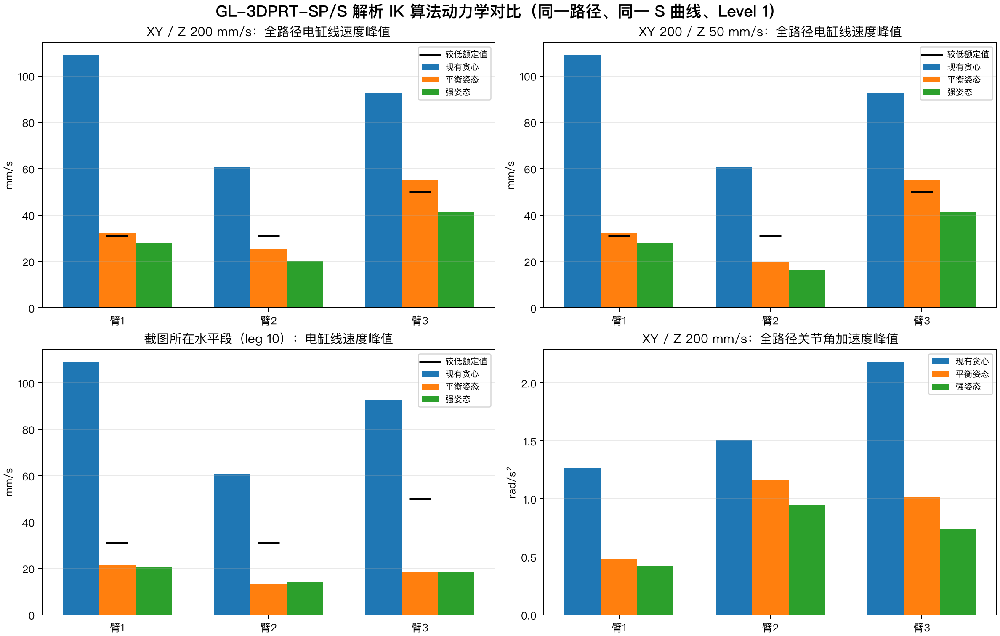

# GL-3DPRT-SP/S 全路径 IK 算法动力学对比

三种方案均使用同一 91.913 m TCP 路径、同一 jerk 受限 S 曲线、相同机械硬限位与 Level 1 动力学口径。

## 截图突变的原因

现有方案在每个空间采样点独立枚举解析 φ 候选，再根据前两点做局部贪心评分。截图所在 leg 10 是 200 mm/s 匀速水平段，没有 S 曲线折返点、没有切肘，也没有离散 IK 跳支；突变来自冗余 φ 在局部快速回转后反向，C² 插值把该高曲率姿态路径转化为较大的 qdot/qddot 与电缸速度峰。

平衡姿态与强姿态方案保留严格解析逆解，仅调整冗余候选的姿态参考和曲率权重；因此不是事后滤波，也没有牺牲 TCP 跟踪。

## 200 mm/s 结果

| 算法 | 电缸速度峰值 Arm1/2/3 (mm/s) | 单缸力峰值 Arm1/2/3 (kN) | 第一组电机扭矩 η=1 (N·m) | 第二组电机扭矩 η=1 (N·m) | 关节角加速度峰值 (rad/s²) |
|---|---:|---:|---:|---:|---:|
| 现有贪心 | 109.025 / 61.006 / 92.776 | 13.155 / 17.055 / 7.401 | 1.309 / 1.697 / 1.178 | 1.396 / 1.810 / 1.178 | 1.265 / 1.508 / 2.180 |
| 平衡姿态 | 32.376 / 25.438 / 55.327 | 12.058 / 16.643 / 7.279 | 1.199 / 1.655 / 1.159 | 1.279 / 1.766 / 1.159 | 0.478 / 1.168 / 1.014 |
| 强姿态 | 27.954 / 20.215 / 41.315 | 12.072 / 16.656 / 7.289 | 1.201 / 1.657 / 1.160 | 1.281 / 1.767 / 1.160 | 0.425 / 0.950 / 0.739 |

## XY 200 / Z 50 mm/s 结果

| 算法 | 电缸速度峰值 Arm1/2/3 (mm/s) | 单缸力峰值 Arm1/2/3 (kN) | 第一组电机扭矩 η=1 (N·m) | 第二组电机扭矩 η=1 (N·m) |
|---|---:|---:|---:|---:|
| 现有贪心 | 109.025 / 61.006 / 92.776 | 13.147 / 17.055 / 6.936 | 1.308 / 1.697 / 1.104 | 1.395 / 1.810 / 1.104 |
| 平衡姿态 | 32.376 / 19.639 / 55.327 | 11.984 / 16.358 / 6.847 | 1.192 / 1.627 / 1.090 | 1.271 / 1.736 / 1.090 |
| 强姿态 | 27.954 / 16.446 / 41.315 | 11.941 / 16.443 / 6.858 | 1.188 / 1.636 / 1.092 | 1.267 / 1.745 / 1.092 |

## 使用边界

- Original/Balanced 坐标下降以及 Active-3/Active-5 DLS 保留在实验参考层；它们是增量控制器或允许非零末端误差，不能直接替代严格几何路径生成正式 q/qdot/qddot。
- 强姿态方案当前是最有希望的候选：200 mm/s 下三臂电缸线速度均低于两组硬件额定值；仍需在更多路径、采样步长和参数扰动下验证后才能替换基线。
- 扭矩为 η=1 理论下限；厂家效率和高速扭矩包络仍为 unknown_pending_supplier_data。

