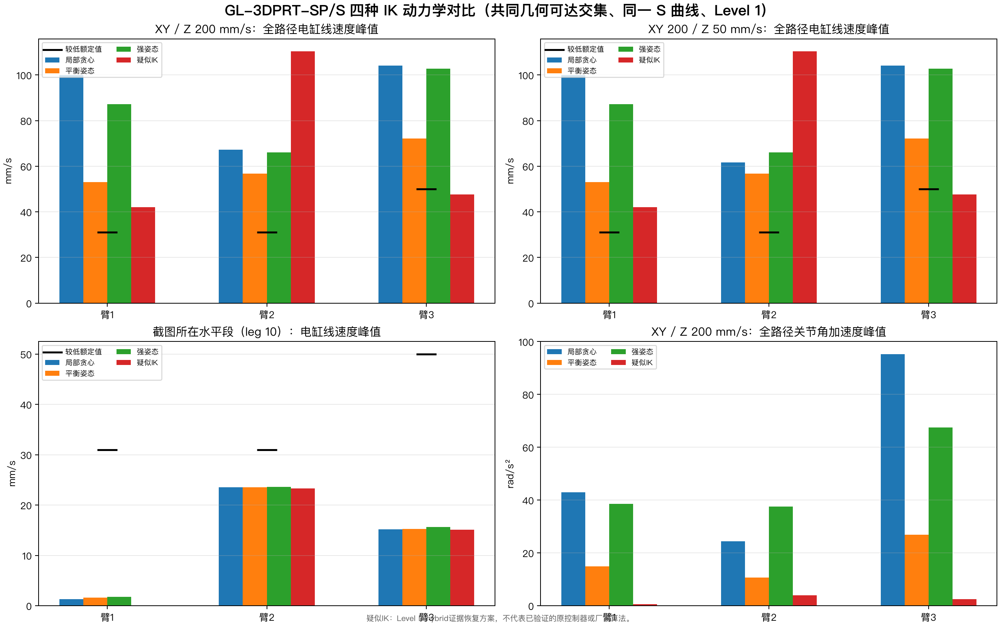

# GL-3DPRT-SP/S 全路径 IK 算法动力学对比

四种方案均使用同一条当前参数计算包络内路径：名义层距 200 mm，高位必要时按 50 mm 步长缩至最低 50 mm；每层填满当前参数模型给出的可行区间，并以同一包络校验连接段；正式路径 178.660 m，最高 Z=7556.2 mm。轨迹均采用同一 jerk 受限 S 曲线、相同当前参数口径与 Level 1 动力学口径。58点资料仅为 unverified_reference，不参与路径或正式图层。

## 截图突变的原因

现有方案在每个空间采样点独立枚举解析 φ 候选，再根据前两点做局部贪心评分。截图所在 leg 10 是 200 mm/s 匀速水平段，没有 S 曲线折返点、没有切肘，也没有离散 IK 跳支；突变来自冗余 φ 在局部快速回转后反向，C² 插值把该高曲率姿态路径转化为较大的 qdot/qddot 与电缸速度峰。

平衡姿态与强姿态方案保留严格解析逆解，仅调整冗余候选的姿态参考和曲率权重；因此不是事后滤波，也没有牺牲 TCP 跟踪。
实际凌蛛IK先按实机视频规律用门控 Active DLS 生成臂1延迟释放预测，再投影到当前严格解析可行集；因此同样精确命中 TCP，并继续满足关节、电缸和固定连杆分支约束。

## 200 mm/s 结果

| 算法 | 电缸速度峰值 Arm1/2/3 (mm/s) | 单缸力峰值 Arm1/2/3 (kN) | 第一组电机扭矩 η=1 (N·m) | 第二组电机扭矩 η=1 (N·m) | 关节角加速度峰值 (rad/s²) |
|---|---:|---:|---:|---:|---:|
| 局部贪心 | 88.040 / 70.174 / 73.288 | 22.450 / 25.075 / 9.765 | 2.233 / 2.494 / 1.554 | 2.382 / 2.661 / 1.554 | 0.933 / 3.280 / 1.796 |
| 平衡姿态 | 75.817 / 62.805 / 42.394 | 22.451 / 25.008 / 9.767 | 2.233 / 2.488 / 1.554 | 2.382 / 2.653 / 1.554 | 0.925 / 3.280 / 1.420 |
| 强姿态 | 73.499 / 58.195 / 31.416 | 22.452 / 25.025 / 9.767 | 2.233 / 2.489 / 1.554 | 2.382 / 2.655 / 1.554 | 0.926 / 3.280 / 1.383 |
| 实际凌蛛IK | 91.710 / 120.330 / 75.612 | 26.971 / 28.217 / 10.985 | 2.683 / 2.807 / 1.748 | 2.862 / 2.994 / 1.748 | 0.954 / 5.940 / 5.716 |

## XY 200 / Z 50 mm/s 结果

| 算法 | 电缸速度峰值 Arm1/2/3 (mm/s) | 单缸力峰值 Arm1/2/3 (kN) | 第一组电机扭矩 η=1 (N·m) | 第二组电机扭矩 η=1 (N·m) |
|---|---:|---:|---:|---:|
| 局部贪心 | 88.040 / 70.174 / 73.288 | 22.450 / 25.075 / 9.151 | 2.233 / 2.494 / 1.457 | 2.382 / 2.661 / 1.457 |
| 平衡姿态 | 75.817 / 62.805 / 42.394 | 22.451 / 25.008 / 9.209 | 2.233 / 2.488 / 1.466 | 2.382 / 2.653 / 1.466 |
| 强姿态 | 73.499 / 58.195 / 31.416 | 22.452 / 25.025 / 9.269 | 2.233 / 2.489 / 1.475 | 2.382 / 2.655 / 1.475 |
| 实际凌蛛IK | 91.710 / 120.330 / 75.612 | 26.971 / 28.217 / 10.985 | 2.683 / 2.807 / 1.748 | 2.862 / 2.994 / 1.748 |

## 使用边界

- Original/Balanced 坐标下降以及未投影的 Active-3/Active-5 DLS 保留在实验参考层；它们是增量控制器或允许非零末端误差，不能直接替代严格几何路径生成正式 q/qdot/qddot。实际凌蛛IK通过严格解析可行集投影消除了这一缺口。
- 在当前 178.660 m 当前参数计算包络路径上，强姿态方案的 200 mm/s 电缸速度峰值 Arm1/2/3 为 73.499 / 58.195 / 31.416 mm/s；是否通过必须逐臂与所选硬件额定线速度比较，不能沿用旧路径结论。
- 因此四种 IK 都必须逐项按全路径需求与额定值比较；算法对比用于识别姿态规划对动力学需求的影响，不替代以额定速度和最不利载荷为准的硬件校核。
- 扭矩为 η=1 理论下限；厂家效率和高速扭矩包络仍为 unknown_pending_supplier_data。

